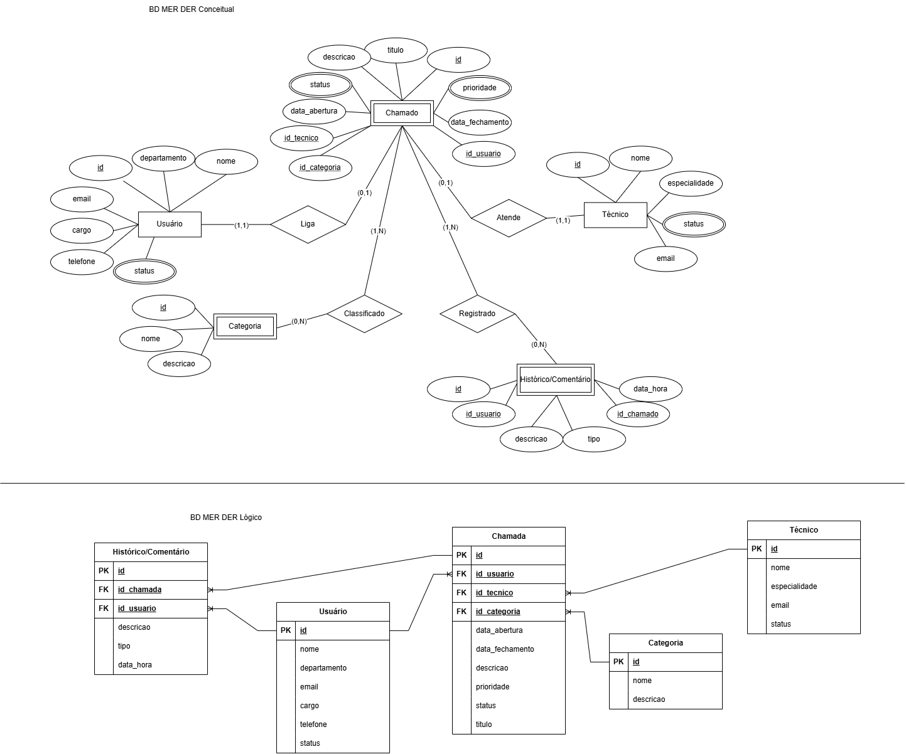

# Banco de Dados do Atendimento a Chamados

Verificação Prática Formativa de Banco de Dados 2º Semestre SESI/SENAI.

## Tema

Banco de Dados para realizar o registro de quem solicita o atendimento, qual é o problema, quem o atende, seu andamento e a solução aplicada.

## MER DER Conceitual e Lógico



## Dados Teste em.csv

[text](dados_teste_em.csv)

## Dicionário de Dados em MarkDown

```
use dados_teste_em;

-- insert into comentario (id, id_usuario, id_chamada, descricao, tipo, data_hora);
-- values(null, null, null, 'a chamada durou 45 minutos e um especialista foi enviado presencialmente', 'acidente', '14:56:12');
-- values(null, null, null, 'a chamada durou 2 horas e um especialista foi enviado presencialmente', 'arrumar software', '07:36:01');
-- values(null, null, null, 'a chamada durou 5 minutos e a especialista resolveu o problema a distancia', 'desatencao', '09:59:59');

-- insert into comentario;


-- insert into comentario;


-- insert into categoria ();
-- values();

-- insert into comentario;

load data local infile "C:\Users\Vitor Parisato\Desktop\vpf_01_bd\dados_teste_em.csv\Comentario";
into table comentario;
fields terminated by ';';
lines terminated by '\n';

load data local infile "C:\Users\Vitor Parisato\Desktop\vpf_01_bd\dados_teste_em.csv\Usuario";
into table usuario;
fields terminated by ';';
lines terminated by '\n';

load data local infile "C:\Users\Vitor Parisato\Desktop\vpf_01_bd\dados_teste_em.csv\Chamado";
into table chamado;
fields terminated by ';';
lines terminated by '\n';

load data local infile "C:\Users\Vitor Parisato\Desktop\vpf_01_bd\dados_teste_em.csv\Categoria";
into table categoria;
fields terminated by ';';
lines terminated by '\n';

load data local infile "C:\Users\Vitor Parisato\Desktop\vpf_01_bd\dados_teste_em.csv\Tecnico";
into table tecnico;
fields terminated by ';';
lines terminated by '\n';
```

## ddl

```
drop database if exists lista_de_atendimento;

create database lista_de_atendimento;

create table comentario(
    id int(11) primary key not null auto_increment,
    id_usuario int(11) primary key not null,
    id_chamada int(11) primary key not null,
    descricao varchar(200) not null,
    tipo varchar(20) not null,
    data_hora varchar(15) not null
);

create table usuario(
    id int(11) primary key not null auto_increment,
    nome varchar(40) not null,
    departamento varchar(20) not null,
    email varchar(15) not null,
    cargo varchar(15) not null,
    telefone decimal(15,2) not null,
    status varchar(20) not null
);

create table chamado(
    id int(11) primary key not null auto_increment,
    id_usuario int(11) primary key not null,
    id_tecnico int(11) primary key not null,
    id_categoria int(11) primary key not null,
    data_abertura date not null,
    data_fechamento date not null,
    descricao varchar(200) not null,
    prioridade varchar(20) not null,
    status varchar(20) not null,
    titulo varchar(20) not null
);

create table categoria(
    id int(11) primary key not null auto_increment,
    nome varchar(40) not null,
    descricao varchar(200)
);

create table tecnico(
    id int(11) primary key not null auto_increment,
    nome varchar(40) not null,
    especialidade varchar(15),
    email varchar(15) not null,
    status varchar(20) not null
);

alter table comentario add constraint fk_usuario foreign key (id_usuario) references usuario(id);
alter table comentario add constraint fk_chamado foreign key (id_chamado) references chamado(id);
alter table chamado add constraint fk_usuario foreign key (id_usuario) references usuario(id);
alter table chamado add constraint fk_tecnico foreign key (id_tecnico) references tecnico(id);
alter table chamado add constraint fk_categoria foreign key (id_categoria) references categoria(id);
```

## dml

```
use dados_teste_em;

-- insert into comentario (id, id_usuario, id_chamada, descricao, tipo, data_hora);
-- values(null, null, null, 'a chamada durou 45 minutos e um especialista foi enviado presencialmente', 'acidente', '14:56:12');
-- values(null, null, null, 'a chamada durou 2 horas e um especialista foi enviado presencialmente', 'arrumar software', '07:36:01');
-- values(null, null, null, 'a chamada durou 5 minutos e a especialista resolveu o problema a distancia', 'desatencao', '09:59:59');

-- insert into comentario;


-- insert into comentario;


-- insert into categoria ();
-- values();

-- insert into comentario;

load data local infile "C:\Users\Vitor Parisato\Desktop\vpf_01_bd\dados_teste_em.csv\Comentario";
into table comentario;
fields terminated by ';';
lines terminated by '\n';

load data local infile "C:\Users\Vitor Parisato\Desktop\vpf_01_bd\dados_teste_em.csv\Usuario";
into table usuario;
fields terminated by ';';
lines terminated by '\n';

load data local infile "C:\Users\Vitor Parisato\Desktop\vpf_01_bd\dados_teste_em.csv\Chamado";
into table chamado;
fields terminated by ';';
lines terminated by '\n';

load data local infile "C:\Users\Vitor Parisato\Desktop\vpf_01_bd\dados_teste_em.csv\Categoria";
into table categoria;
fields terminated by ';';
lines terminated by '\n';

load data local infile "C:\Users\Vitor Parisato\Desktop\vpf_01_bd\dados_teste_em.csv\Tecnico";
into table tecnico;
fields terminated by ';';
lines terminated by '\n';
```